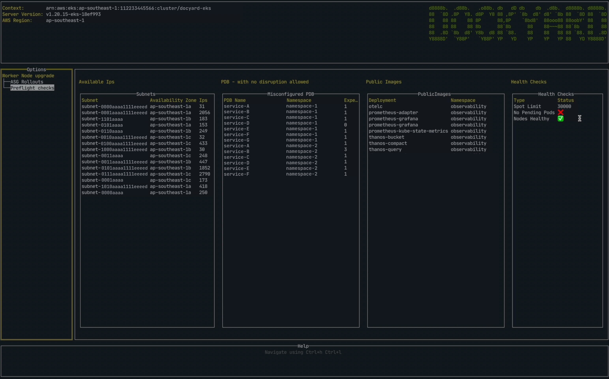
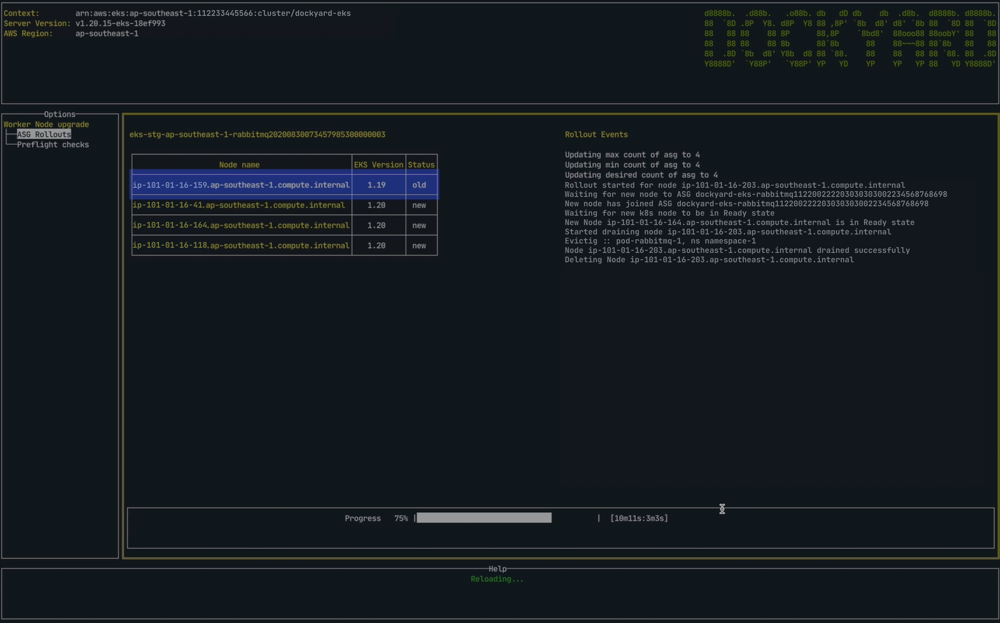

# DOCKYARD

The goal of Dockyard is to serve as a one-stop solution for all maintenance tasks involving kubernetes clusters. Dockyard, in its current iteration, can be used to perform a rolling upgrade of Kubernetes worker nodes as well as doing preflight checks before the upgrade.


# Quick Start

Dockyard is shipped as a single binary which is CLI application offering a terminal UI. 

To get started, download the latest release from releases.


## Requirements


### AWS Permissions Required
* autoscaling:DescribeAutoScalingGroups
* autoscaling:TerminateInstanceInAutoScalingGroup
* autoscaling:UpdateAutoScalingGroup
* autoscaling:CreateOrUpdateTags
* autoscaling:DeleteTags
* autoscaling:DescribeAutoScalingInstances
* autoscaling:DescribeLaunchConfigurations
* ec2:DescribeLaunchTemplates
* ec2:DescribeInstance
* ec2:TerminateInstances
* ec2:DescribeSubnets

### K8s Cluster Role

```yaml
rules:
- apiGroups:
- "*"
resources:
- pods
verbs:
- get
- list
- apiGroups:
- "*"
resources:
- pods/eviction
verbs:
- create
- apiGroups:
- "*"
resources:
- nodes
verbs:
- get
- list
- update
- patch
```

* AWS credentials configured
* KUBECONFIG environment variable set, or config available in ${HOME}/.kube/config per default

- Ensure that you have selected the correct k8s context.
```bash
kubectl config use-context <CONTEXT_NAME>
```

- Update the [config.yaml](config-example.yaml) to select specific aws region and profile. 
Dockyard binary, [config.yaml](config-example.yaml) should be in same working directory.

```yaml
AWS_CONFIG:
AWS_REGION: 
AWS_PROFILE:
```

- Add following to config.yaml to enable logging. 
```yaml
LOGGING:
LEVEL: DEBUG
```

## Build dockyard from source

```bash
go build ./cmd/main.go

```
## Features
- Preflight Checks
  - Public Images used : To list all the images that are pulled from public registries. 
( To avoid rate limiting from public registries )

  - Available Ips in each subnet/AZ
  - Misconfigured PDBs : Lists all PDBs which has maxUnavailable to 0% or 0
which essentially means there should be zero voluntary evictions. ( This can cause issues while draining the node during the rollout )
  - Cluster Health status
  - Nodes Health : Checks if all nodes are in Ready State.
  - Pending pods : Checks if any of the existing workload isn't in Running state.

  

  - Rolling upgrade of Worker Nodes : Gracefully drain old nodes of specific asg in batches ( currently limited to 1 ) to new worker nodes.
  - Upgrading EKS cluster
  - Applying critical security patches

  


## Rollout process 

  Rollout process is executed following 3 phases.

### Pre Rollout

  * Cordon all nodes of the selected ASG.
  * Mark all old nodes which were launched using old launch config, templates for Rollout by adding label `dockyard.io/node-state = old` to node.
  * Update ASG Tags to store initial state of ASG.
  * dockyard.io/min  = Initial min count of ASG 
  * dockyard.io/max = Initial max count of ASG
  * dockyard.io/desired = Initial desired count of ASG
  * Update ASG with new instances scale in protection
  * Scale up ASG with initial batch size.


###  Main Rollout

  * Wait for new nodes to join the cluster and reach the Ready state. 
  * Start draining all the nodes one by one which are labelled for a rollout
  * Add label `dockyard.io/node-state = new` to the new node.
  * Delete the old node from the cluster
  * Terminate the corresponding EC2 instance.


###  Post Rollout

  * Remove label `dockyard.io/node-state = new` from all the new nodes
  * Restore initial count of min, max and desired instances of ASG and remove all tags which were applied during prerollout stage.
  * Remove instance scale-in protection from all the instances and the ASG


## How to configure Dockyard ?


  | Config Parameter               | Default Value | Description                                                                                                                        | Required | Type |
  |--------------------------------|---------------|------------------------------------------------------------------------------------------------------------------------------------|----------|------|
  | AWS_CONFIG.AWS_REGION          | none          | AWS region in which EKS cluster is running.                                                                                         | YES      | String    | 
  | AWS_CONFIG.AWS_PROFILE         | default       | AWS Profile which has all the required permissions                                                                                 | YES      | String    |
  | LOGGING.LEVEL                  | none          | Logging level for dockyard                                                                                                         | NO       | String    |
  | ASG_ROLLOUT.IGNORE_NOT_FOUND   | true          | Dockyard would ignore all not found errors from kube-api server apis, ( Is useful when cluster is running on spot intances )       | NO       | Boolean    |
  | ASG_ROLLOUT.FORCE_DELETE_PODS  | false         | Enable dockyard to force delete pods. Enabling this would ignore PDBs associated with workload( not recommended for prd clusters ) | NO       | Boolean    |
  | ASG_ROLLOUT.PERIOD_WAIT.BEFORE_POST  | 60         | Wait (in seconds) before executing Post rollout steps | NO       | Int    |
  | ASG_ROLLOUT.PERIOD_WAIT.AFTER_BATCH  | 30         | Wait (in seconds) before  starting rollout of new batch of nodes |NO       | Int    | 
  | ASG_ROLLOUT.PERIOD_WAIT.K8S_READY  | 30         | This variable specify dockyard to check node readiness after defined seconds |NO       | Int    |
  | ASG_ROLLOUT.PERIOD_WAIT.NEW_NODE_ASG_REGISTER  | 30         | This variable specify how often dockyard should check if a new instance has joined in an ASG (in seconds).|NO       | Int    |
  | ASG_ROLLOUT.TIMEOUTS.NEW_NODE_ASG_REGISTER | 600         | Number of seconds to wait for the new instance to join the cluster before timeout |NO       | Int    |
  | ASG_ROLLOUT.PRIVATE_REGISTRY   | none          | Private image registry. (Apart from this registry every image registry would be considered as a public registry)     | Yes       | String    | 
  | ASG_ROLLOUT.EKS_CLUSTER_NAME   | none          | EKS cluster name      | Yes       | String    | 


#### config.yaml
```yaml
AWS_CONFIG:
  AWS_REGION: <region_name>
  AWS_PROFILE: <aws_profile>
LOGGING:
  LEVEL: DEBUG
ASG_ROLLOUT:
  EKS_CLUSTER_NAME: <eks-cluster-name>
  IGNORE_NOT_FOUND: true
  FORCE_DELETE_PODS: false
  PERIOD_WAIT:
    BEFORE_POST: 60
    AFTER_BATCH: 30
    K8S_READY: 10
    NEW_NODE_ASG_REGISTER: 10
  TIMEOUTS:
    NEW_NODE_ASG_REGISTER: 600
  PRIVATE_REGISTRY:  "git.example.registry.com"
```

## Navigation

You can use standard vim keybindings to navigate around dockyard.

## FAQ
An FAQ is available [here]( faq.md )

## How to Contribute ?

  We  ❤️  PR's

  Contribution, in any kind of way, is highly welcome! It doesn't matter if you are not able to write code. Creating issues and helping other people to use  [dockyard](https://github.com/olxgroup-oss/dockyard)  is contribution, too! A few examples:

  -   Correct typos in the README / documentation
  -   Reporting bugs
  -   Implement a new feature or endpoint
  -   Sharing the love of  [dockyard](https://github.com/olxgroup-oss/dockyard)  and help people to get use to it

  If you are new to pull requests, checkout  [Collaborating on projects using issues and pull requests / Creating a pull request](https://help.github.com/articles/creating-a-pull-request/).

## Development

  To install the git hooks in your local machine:

  ```
  sh -c "$(curl -fsSL https://raw.githubusercontent.com/rycus86/githooks/master/install.sh)" -- --non-interactive --single
  ```
## License

  (c) Copyright 2019-2020 [OLX](https://olxgroup.com). Released under [Apache 2 License](LICENSE)
